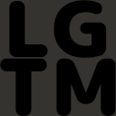
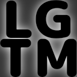

[](https://crates.io/crates/sledash)
[](https://docs.rs/sledash)


## Sledash




Sledash is an abbreviation for *Slack Emoji Darkmode Shader*.

Fetch emoji lists from your Slack workspace and add white shades for better visibilities in the darkmode.

Set `SLACK_APP_ACCESS_TOKEN` environment variable to your Slack OAuth Access Token with `emoji:read` scope granted.

WIP: As of now, adding the shades to gif animations does not work well (some wierd animations will be generated.)

## Requirements

- Clang
  - See the [Requirements page](https://rust-lang.github.io/rust-bindgen/requirements.html) of [rust-bindgen](https://github.com/rust-lang/rust-bindgen).

- ImageMagick >= 7.0.10

- MagickWand headers files

- MagickWand development files

- pkg-config

If the command below:

```
$ pkg-config --exists MagickWand; echo $?
```

does not show `0`, something are missing. Check your environment again and install the missing packages.

## License

MIT OR Apache-2.0
